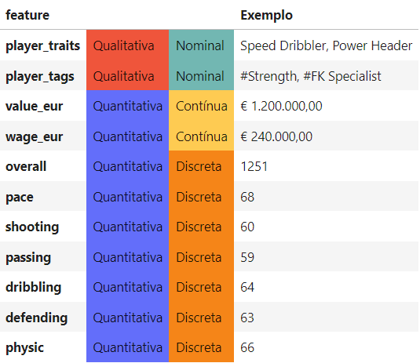

# Machine Learning: Desvendando o FIFA 22

    

> Esse projeto foi desenvolvido durante o 3 semestre da nossa graduação em Ciência de Dados e Inteligência Artificial na PUC-SP e entregue dia 17/06/2022

## 1. Contextualização

O mercado de *E-sports* é muito competitivo e necessita que cada decisão seja tomada cuidadosamente. Para o apoio da tomada de decisão, é preciso analisar uma quantidade muito grande de atributos, o que torna difícil para um ser humano, mesmo sendo um jogador profissional, assimilar todas as "regras de negócio" do jogo para que ele possa manifestar o seu melhor desempenho.

O modo *Ultimate Team* é particularmente mais desafiador. Nele o jogador inicia o jogo com um time modesto e precisa além de desempenhar bem nos jogos, de uma grande capacidade de gerenciamento do seu time para poder evoluir, além de conhecimento sobre futebol porque nem toda carta (jogador de futebol dentro do jogo) boa se encaixa no time por uma questão de entrosamento, estilo de jogo e seu gosto pessoal. Quando olhamos para o alto nível de desempenho dos jogadores profissionais então, cada pequena melhora, cada oportunidade, pode mudar totalmente o resultado da partida. Então, como aspirantes a cientistas de dados, decidimos desenvolver um software baseado em modelos de machine learning para recomendar a melhor carta para diversas situações de jogo, como cobranças de falta e escanteios, ajudando os jogadores à alcançarem o ápice de seu desempenho atingindo níveis ainda mais altos.

Dessa forma, iremos prever:
- o valor de mercado (€) dos jogadores
- os atributos dos goleiros (pace, shooting, passing, dribbling, defending, physic)
- se um jogador é ou não considerado especialista em tiro livre

## 2. Descrição dos dados

O dataset usado nesse projeto [pode ser encontrado no Kaggle](https://www.kaggle.com/datasets/stefanoleone992/fifa-22-complete-player-dataset)

Número de instâncias (linhas): 19.239

Número de atributos (preditores): 91

Número de atributos após pré-processamento : 337

Variáveis alvo:
- valor de mercado (€): `value_eur`
- atributos dos goleiros: `pace`, `shooting`, `passing`, `dribbling`, `defending`, `physic`
- especialista em tiro livre: `#FK Specialist` (gerada a partir do OneHotEncode da coluna _player_tags_)

## 4. Modelagem e Avaliação de Modelos

### Algorítmos usados:
- Floresta Aleatória de Regressão
- Regressão Linear
- Regressão Logística
- Floresta Aleatória de Classificação